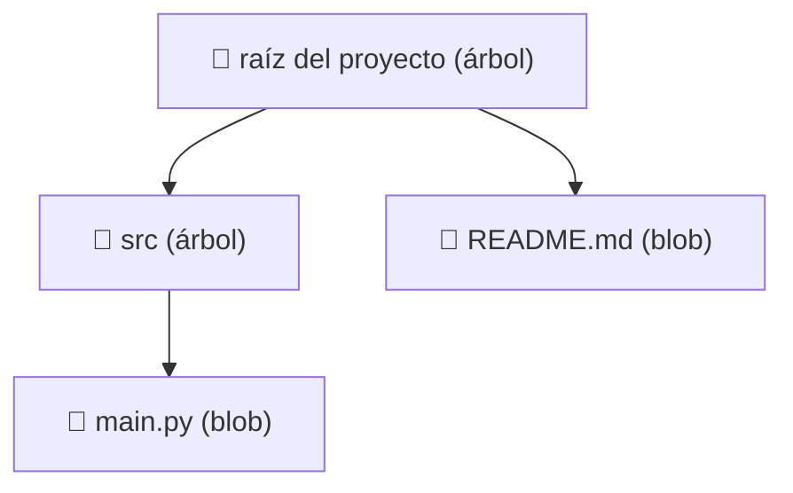
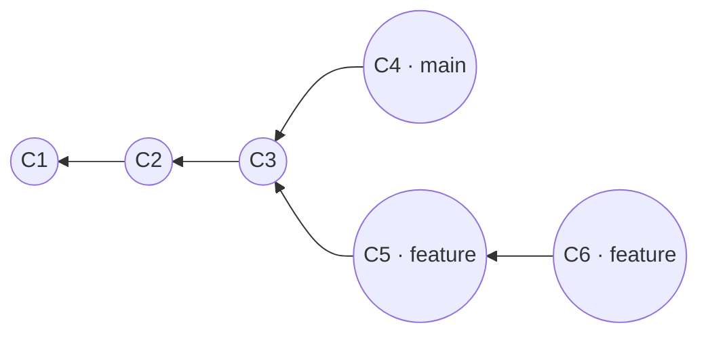
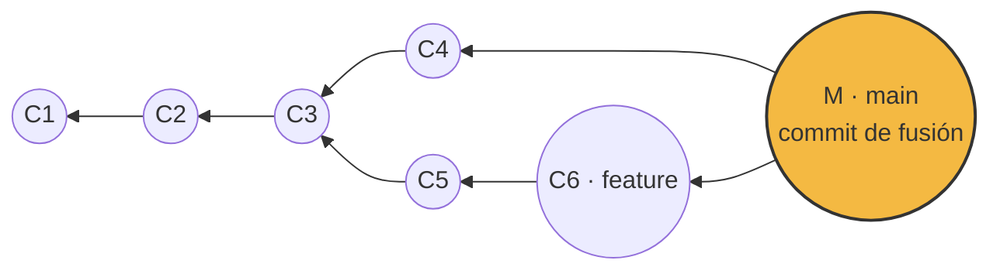
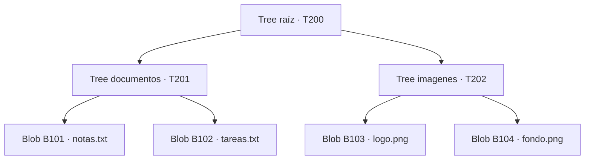
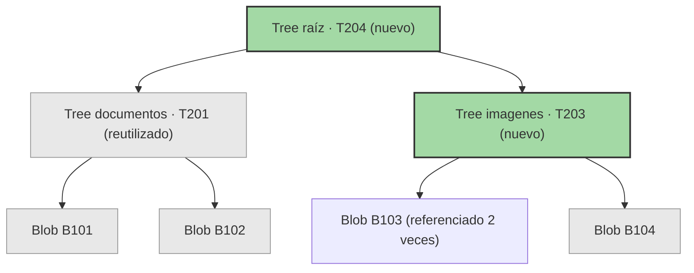
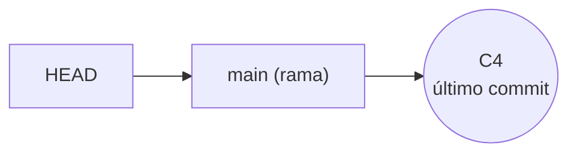
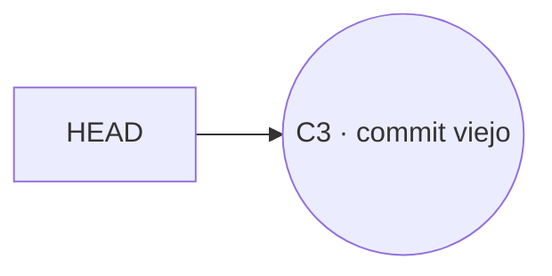
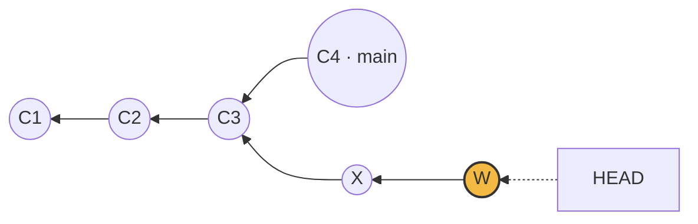
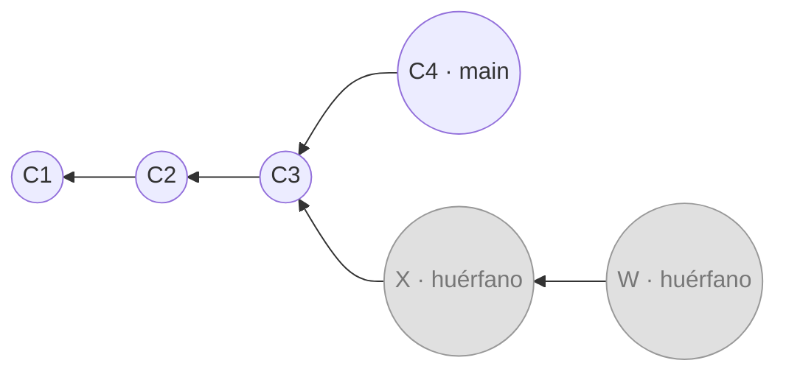
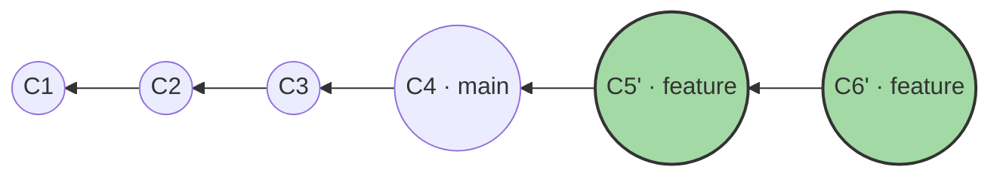

# Control de versiones y Git

*Resumen y traducción detallada de la clase ["Version Control and Git"](https://missing.csail.mit.edu/2026/version-control/) — MIT Missing Semester, edición 2026.*

Este documento está escrito con mis propias palabras, no es una traducción literal. La idea es explicar el **porqué** de cada pieza del modelo de Git, no solo el **qué** hace cada comando — así, en vez de memorizar instrucciones sueltas, vas a poder deducir la mayoría de los comandos nuevos que te encuentres a partir de cómo funciona el sistema por dentro.

**Índice**

1. Introducción
2. El modelo de datos de Git
3. Blobs
4. Árboles (Trees)
5. Commits
6. SHA-1: objetos y direccionamiento por contenido
7. Referencias
8. Repositorios
9. El área de staging
10. Branches
11. Merge
12. Rebase
13. Repositorios remotos
14. Comandos explicados
15. Aspectos adicionales
16. Recursos
17. Ejercicios propuestos

> **Nota sobre la estructura:** seguí tu orden casi tal cual, con dos ajustes. Primero, puse **Blobs** y **Árboles** antes que **Commits** — un commit se define en términos de un árbol, y un árbol en términos de blobs, así que entenderlos en ese orden evita tener que adivinar a qué se refieren a medias (de hecho, así es también como los presenta la lección original). Segundo, agregué algunas secciones que sí aparecen en la clase pero no estaban en tu lista — **Repositorios**, **El área de staging**, y dentro de "Comandos explicados" también **Deshacer cambios** y **Git avanzado** — más **Aspectos adicionales** y **Ejercicios propuestos** al final, para que el resumen cubra realmente toda la lectura. Todo lo demás sigue tu estructura.

> **Actualización — dudas incorporadas:** esta versión suma todas las dudas que te surgieron leyendo la primera versión, marcadas con **❓ Duda** justo al lado del tema exacto al que pertenecen — así, si alguna te vuelve a surgir más adelante, la vas a encontrar donde importa, no perdida en una lista genérica. Cuando una respuesta ya quedó explicada en otro punto del documento, dejo un enlace hacia ahí en vez de repetirla. El contenido original se mantiene completo; varias explicaciones se ampliaron, y un par se corrigieron levemente, a partir de esas dudas.

---

## Introducción

Un **sistema de control de versiones** (VCS, por sus siglas en inglés) es una herramienta que registra los cambios que le haces a un conjunto de archivos y carpetas a lo largo del tiempo — típicamente, código fuente. La idea central es simple: en vez de tener una sola copia de tu proyecto que vas sobrescribiendo, el VCS guarda una serie de **instantáneas** (*snapshots*), donde cada instantánea es una "foto" completa de cómo estaban todos tus archivos y carpetas en un momento dado. Junto con cada instantánea también se guardan metadatos: quién la creó, cuándo, y un mensaje explicando qué cambió y por qué.

¿Por qué es útil esto? Incluso trabajando solo en un proyecto, te permite:

- Volver a ver versiones anteriores de tu trabajo.
- Tener un registro — casi un diario — de por qué tomaste ciertas decisiones, gracias a los mensajes de cada commit.
- Trabajar en varias líneas de desarrollo en paralelo (ramas) sin que una interfiera con la otra.

Y cuando trabajas en equipo, un VCS se vuelve prácticamente indispensable: te deja ver qué cambió cada persona, y resolver de forma ordenada los conflictos que surgen cuando dos personas modifican lo mismo al mismo tiempo.

Los VCS modernos, además, te dejan responder preguntas muy concretas casi automáticamente:

- ¿Quién escribió este módulo?
- ¿Cuándo se editó esta línea específica de este archivo? ¿Quién lo hizo? ¿Por qué?
- De las últimas 1000 revisiones, ¿en cuál se rompió esta prueba automática, y por qué?

Existen varios VCS, pero **Git** es, hoy en día, el estándar de facto — casi cualquier proyecto de software que veas lo usa. Tiene fama (merecida, hasta cierto punto) de ser confuso: es común el chiste de programadores que memorizan un puñado de comandos como si fueran hechizos, y cuando algo sale mal, en vez de entender qué pasó, simplemente borran su repositorio local y lo vuelven a clonar desde cero. La lección original incluso referencia [una tira cómica de xkcd](https://xkcd.com/1597/) sobre esto — vale la pena buscarla, retrata bastante bien esa sensación.

**Y aquí está la idea más importante de toda la lección, la que le da forma a todo lo que sigue:** la interfaz de línea de comandos de Git es lo que se llama una "abstracción con fugas" (*leaky abstraction*): no te oculta bien lo que pasa por debajo, así que para usarla correctamente en la práctica necesitas entender qué está pasando internamente. Por eso, si aprendes Git "de arriba hacia abajo" — empezando por los comandos, sin entender el modelo de datos detrás — terminas memorizando instrucciones sueltas sin conexión entre sí, como conjuros. Pero si lo aprendes "de abajo hacia arriba", entendiendo primero cómo Git guarda y organiza tu historia, cada comando deja de ser un misterio y se vuelve una consecuencia lógica de ese modelo.

En otras palabras: **una interfaz fea hay que memorizarla; un diseño bonito se puede entender.** Por eso este resumen (como la clase original) arranca explicando el modelo de datos de Git a fondo, y solo después llega a los comandos — que para ese punto ya deberían sentirse obvios. Esto encaja exactamente con la forma en que quieres aprender: en vez de memorizar "para hacer X, escribo el comando Y", vas a entender qué le hace cada comando a la estructura de datos subyacente.

---

## El modelo de datos de Git

La genialidad de Git está en un modelo de datos muy bien pensado, que es lo que hace posible todo lo que esperamos de un control de versiones: mantener historia, tener ramas, y facilitar la colaboración. Vale la pena remarcar algo desde ya: Git no guarda tu historia como una lista de "diferencias" entre una versión y la siguiente (como sí hacen algunos sistemas más antiguos) — guarda **instantáneas completas**. Cada "versión" en Git es, conceptualmente, una foto entera de todo tu proyecto en ese momento (por debajo, Git es lo bastante inteligente como para no duplicar contenido que no cambió, pero eso es una optimización interna: conceptualmente, siempre estás viendo fotos completas, no parches acumulados).

Este modelo se construye con tres piezas — **blobs**, **árboles** y **commits** — más un mecanismo para nombrarlas y encontrarlas: el **direccionamiento por contenido** (usando SHA-1) y las **referencias**. Vamos una por una.

---

## Blobs

Un **blob** ("*binary large object*") es la pieza más simple del modelo: representa el **contenido** de un archivo, y nada más. Ni el nombre del archivo, ni su ubicación, ni sus permisos — únicamente la secuencia de bytes que forman su contenido.

```
// un blob es, conceptualmente, solo una secuencia de bytes:
// el contenido de un archivo, sin nombre ni ubicación
tipo Blob = secuencia<byte>
```

**¿Por qué separar el "contenido" del "nombre"?** Esta decisión de diseño, aparentemente pequeña, tiene una consecuencia enorme: si dos archivos distintos (en carpetas distintas, con nombres distintos) tienen exactamente el mismo contenido, Git solo necesita guardar **un** blob para ambos — el nombre y la ubicación se guardan en otro lugar (en los árboles, que vemos a continuación).

> **❓ Duda: no entendí el ejemplo del archivo de 10,000 líneas**
>
> Vale la pena frenar acá, porque es de los puntos que más confunden al empezar con Git. Es fácil leer la frase anterior y pensar "entonces, si cambio una línea, Git solo guarda esa línea" — **no es así**, y separar las dos cosas que pasan en ese momento ayuda mucho:
>
> - **El archivo que modificaste** (tu archivo de 10,000 líneas): Git le crea un **blob completamente nuevo**, con las 10,000 líneas enteras adentro (9,999 sin cambios + 1 modificada). A nivel de su modelo de datos, Git no piensa en "diferencias" ni guarda solo la línea que cambió — piensa en contenido completo. Cambió el contenido → hash distinto → blob distinto, completo.
> - **Los demás archivos del proyecto** (los que NO tocaste): esos sí siguen apuntando exactamente al mismo blob de antes, porque su contenido no cambió ni un byte, así que su hash tampoco cambió.
>
> El ahorro real, entonces, no está en "guardar solo el cambio" dentro del archivo que modificaste — está en **no tener que volver a guardar los archivos que no cambiaron**. Si tu proyecto tiene 50 archivos y modificas uno, Git crea 1 blob nuevo y reutiliza los otros 49; una copia ingenua tendría que volver a escribir los 50.
>
> Un detalle extra para que quede completo: lo anterior es el **modelo conceptual** de Git (cada versión de un archivo es un objeto completo e independiente). Por debajo, cuando Git empaqueta objetos para ahorrar espacio en disco o para transferirlos por red — algo que pasa, por ejemplo, al correr `git gc` o al clonar un repositorio — sí es capaz de comprimir usando algo parecido a diferencias entre blobs similares, en lo que se llama un *packfile*. Pero eso es una optimización de almacenamiento que vive **debajo** del modelo; no cambia el hecho de que, conceptualmente, cada blob representa un contenido completo, no un parche.

---

## Árboles (Trees)

Un **árbol** es la forma en que Git representa una **carpeta**. Es, en esencia, una tabla que relaciona nombres con otra cosa, y esa "otra cosa" puede ser un blob (un archivo) o **otro árbol** (una subcarpeta). Como un árbol puede contener otros árboles, esta definición es recursiva — y así es exactamente como funcionan las carpetas de verdad: una carpeta tiene archivos y también subcarpetas, que a su vez tienen sus propios archivos y subcarpetas.

```
// un árbol relaciona nombres con archivos (blobs) o subcarpetas (otros árboles)
tipo Arbol = diccionario<nombre: texto, Arbol | Blob>
```

Por ejemplo, imagina que tu proyecto se ve así:

```
<raíz> (árbol)
│
├── src (árbol)
│   │
│   └── main.py (blob, contenido = "print('hola mundo')")
│
└── README.md (blob, contenido = "Proyecto de ejemplo")
```

El árbol de la raíz contiene dos elementos: un árbol llamado `src` (que a su vez contiene un blob llamado `main.py`), y un blob llamado `README.md` directamente en la raíz. Visualizado como grafo:



*Cada flecha indica "contiene" — la raíz contiene a `README.md` y a `src`; `src` contiene a `main.py`.*

Un detalle importante: el árbol **no contiene** literalmente el contenido de sus archivos ni de sus subcarpetas, contiene **punteros** hacia ellos (más exactamente, como vamos a ver en la próxima sección, contiene el *hash* de cada uno). Junto a cada entrada, el árbol también guarda un código que indica el tipo. Por ejemplo, si le pidieras a Git que te muestre el contenido interno de este árbol de raíz, verías algo con esta forma (los hashes son ilustrativos):

```
100644 blob 8f94139338f9...    README.md
040000 tree a1b2c3d4e5f6...    src
```

`100644` es el código de tipo/permisos de un archivo normal (no ejecutable), y `040000` es el código para una subcarpeta. Después viene la palabra `blob` o `tree`, el hash que identifica ese objeto, y el nombre con el que aparece en esta carpeta.

**Idea clave:** una instantánea completa de tu proyecto no es más que el árbol del nivel más alto (la raíz) en un momento dado — y como ese árbol apunta recursivamente a todo lo demás, con solo ese árbol Git puede reconstruir el estado completo de todos tus archivos y carpetas.

---

## Commits

Ya sabemos representar el contenido (blobs) y la estructura de carpetas (árboles) de una instantánea completa. Pero falta algo: conectar esa instantánea con el resto de la **historia**, y guardar metadatos sobre ella (quién, cuándo, por qué). Para eso existen los **commits**.

```
// un commit tiene padres (de dónde viene), metadatos, y la instantánea (árbol) que representa
tipo Commit = {
    padres: lista<Commit>,
    autor: texto,
    mensaje: texto,
    instantanea: Arbol
}
```

Fíjate en un detalle que a primera vista puede parecer raro: `padres` es una **lista**, no un solo valor. ¿Por qué tendría un commit más de un padre?

### Modelando la historia: un grafo, no una lista

La forma más simple de modelar el historial de cambios sería una lista: instantánea 1, luego 2, luego 3, en una sola línea recta de tiempo. Pero Git no funciona así. En Git, la historia es lo que en ciencias de la computación se llama un **grafo acíclico dirigido**, o **DAG** (*Directed Acyclic Graph*). Suena intimidante, pero la idea es simple si la desarmamos:

- **Dirigido**: cada conexión entre dos commits tiene una dirección — apunta desde un commit hacia su(s) **padre(s)**, es decir, hacia lo que vino *antes*.
- **Acíclico**: no hay forma de, siguiendo esas conexiones, dar la vuelta y regresar a un punto anterior. La historia solo avanza, nunca forma un círculo.
- **Grafo**: en vez de una única línea, es una red de nodos conectados que se puede ramificar y volver a juntar.

> **❓ Duda: ¿puedes profundizar en "grafo acíclico dirigido" con un ejemplo?**
>
> Vale la pena separar las tres palabras con calma, porque cada una resuelve un problema distinto.
>
> **Grafo, no lista.** Imagina que estás escribiendo una novela: versión 1, luego 2, luego 3, luego 4. Mientras todo avance en una sola dirección (`V1 → V2 → V3 → V4`), una lista alcanza perfectamente. El problema aparece cuando quieres **experimentar sin arriesgar lo que ya tienes** — programando un videojuego, por ejemplo, ya tienes una versión estable (`A → B → C`) y quieres probar un sistema de combate nuevo sin romper el juego principal. Con una lista, la única opción sería copiar toda la carpeta (`juego_copia_final_v2`, ese clásico). Un grafo te deja simplemente **abrir un segundo camino** desde el mismo punto (`C`), sin tocar el primero.
>
> **Dirigido, y en la dirección que menos se espera.** Solemos dibujar la historia como `A → B → C`, sugiriendo "A viene primero, luego B, luego C". Pero el puntero que Git guarda *adentro* de cada commit apunta al revés: `C` es quien guarda "mi padre es `B`", y `B` guarda "mi padre es `A`". La razón es concreta: cada commit solo puede grabar esa información en el momento en que él mismo se crea, apuntando hacia algo que ya existía antes. No puede ser al revés — cuando `B` se creó, `C` todavía ni existía.
>
> **Acíclico: no por regla, sino por imposibilidad.** Un ciclo significaría poder salir de un commit y, siguiendo padres, volver exactamente a él — algo como `A → B → C → D → A`. Esto no es solo algo que Git "prohíba": es **estructuralmente imposible**, por el mismo motivo del punto anterior. Para que `A` apuntara a `D` como su padre, `D` ya tendría que existir en el momento en que se creó `A` — pero `A` fue el primer commit del proyecto, antes de que `D` existiera siquiera. Sería pedirle a un commit que dependa de algo del futuro. Por eso la historia de Git solo puede mirar hacia atrás: la propia mecánica de cómo se crean los commits (uno a la vez, cada uno apuntando a algo que ya existía antes que él) hace que un ciclo sea imposible de construir, no solo indeseable.

La mayoría de los commits tienen exactamente **un** padre (el commit inmediatamente anterior). Pero hay dos casos especiales:

- El **primer commit** de un repositorio no tiene ningún padre.
- Un **commit de fusión** (*merge commit*) tiene **dos o más** padres, porque representa el punto donde dos líneas de desarrollo que avanzaban por separado se juntan en una sola.

Visualmente, una historia que se ramifica se ve así (cada flecha apunta hacia el padre):



*C1 es el primer commit (sin padre). A partir de C3, la historia se separa en dos líneas: una sigue como `main` (hasta C4), y otra arranca como `feature` (C5, luego C6) — ambas comparten el mismo pasado.*

> **❓ Duda: si los commits solo apuntan "hacia atrás", ¿por qué `C6` no podría apuntar directo a `C1` en vez de a `C5`, ya que `C1` también es más viejo?**
>
> Porque "apuntar hacia atrás" no es lo mismo que "poder apuntar a cualquier punto anterior". La regla real es más estricta: **un commit apunta únicamente a su padre inmediato**, al commit exacto del que "nació". `C6` no responde "¿cuál es el commit más viejo de todos?" — responde **"¿de qué commit vengo yo?"**, y la respuesta es `C5`, porque `C6` se creó a partir del estado que describía `C5` (que a su vez ya incluía todo lo ocurrido en `C3`, `C2` y `C1`). Si `C6` apuntara directo a `C1`, estaría "mintiendo": diría que nació directamente de `C1`, ignorando por completo el trabajo hecho en `C3` y `C5` — se perdería esa parte de la historia.

Esto podría representar, por ejemplo, que después de `C3` alguien empezó a trabajar en una función nueva en una rama aparte, mientras el trabajo normal seguía avanzando en `main`. Más adelante, esas dos líneas se pueden **fusionar**, creando un nuevo commit con **dos padres**, uno por cada línea que se une:



*El commit `M` tiene dos padres: `C4` y `C6`. Ahora `main` apunta a `M`.* (Vamos a ver la fusión en detalle en la sección **Merge**; por ahora, quédate con la idea de que un commit de fusión es simplemente un commit con más de un padre.)

### Los commits son inmutables

Este es, probablemente, el concepto más importante de esta sección, y el que te va a ayudar a entender comandos que de otra forma parecen mágicos (como `rebase` o `commit --amend`): **una vez creado, un commit nunca cambia.** Es un objeto fijo, congelado en el tiempo.

Esto no significa que no puedas "corregir" tu historia — sí puedes. Lo que pasa es que corregir un commit en Git nunca significa editarlo por dentro; significa **crear un commit completamente nuevo** (con el contenido corregido), y luego actualizar las **referencias** (siguiente sección) para que apunten a este commit nuevo en vez del viejo. El commit original sigue existiendo por ahí un tiempo, pero deja de estar conectado a la historia visible — nada apunta hacia él. Vas a ver este patrón una y otra vez en Git: **arreglar algo casi siempre significa crear algo nuevo y mover un puntero, no modificar lo que ya existe.**

<a id="efecto-domino"></a>

> **❓ Duda: si el hash de un commit depende del hash de su padre, ¿"editar" un commit viejo obliga a recrear también a todos sus descendientes?**
>
> Exactamente eso, y vale la pena verlo paso a paso porque es el mismo patrón que vas a encontrar en `commit --amend`, en `rebase`, y en herramientas para reescribir historia como `git filter-repo`.
>
> Primero, un detalle importante: el hash de un objeto se calcula sobre **todo** su contenido. Para un blob, son los bytes del archivo. Para un árbol, son sus entradas (nombre + hash de cada blob/árbol que contiene). Para un commit, es su árbol, su autor, su mensaje, y —la clave acá— **el hash de su padre**. Ningún objeto se modifica jamás "por dentro"; si algo cambia, aparece un objeto nuevo con un hash nuevo, y el viejo se queda tal cual, sin que nada lo borre de inmediato.
>
> Ahora imagina la cadena `A → B → C → D` (recordando el punto anterior, en realidad `D` apunta a `C`, `C` a `B`, y `B` a `A`). Supón que "editas" `B` — cambias su mensaje, por ejemplo. Como el contenido de `B` cambió, Git no lo modifica: crea `B'`, con un hash distinto.
>
> El problema es que `C` todavía dice, dentro de sí mismo, "mi padre es `B`" (el viejo). Para que la historia visible sea `A → B' → C`, `C` tendría que decir "mi padre es `B'`" — así que Git también tiene que crear `C'`, idéntico a `C` en todo menos en que su padre ahora es `B'`. Y por la misma razón, `D` tampoco puede quedarse igual: aparece `D'`, apuntando a `C'`.
>
> ```mermaid
> graph RL
>     A(("A"))
>     B(("B<br/>huérfano")) --> A
>     C(("C<br/>huérfano")) --> B
>     D(("D<br/>huérfano")) --> C
>     Bp(("B'")) --> A
>     Cp(("C'")) --> Bp
>     Dp(("D' · rama")) --> Cp
>
>     classDef viejo fill:#e0e0e0,stroke:#999,stroke-width:1px,color:#777;
>     classDef nuevo fill:#a3d9a5,stroke:#333,stroke-width:2px;
>     class A,B,C,D viejo
>     class Bp,Cp,Dp nuevo
> ```
>
> `A → B → C → D` (en gris) no se borra de golpe — simplemente ninguna referencia vuelve a apuntar hacia ahí, así que queda huérfano hasta que el recolector de basura de Git lo limpie. La rama ahora apunta a `D'`.
>
> **¿Y cómo se "edita" realmente un commit viejo, en la práctica?** No haces `checkout` a `B`, lo cambias, y esperas que `C` y `D` se enteren solos — eso no existe. Lo que hace `git rebase -i` por ti es automatizar exactamente esta reconstrucción en cadena: tomar el commit que quieres cambiar, aplicar tu corrección, y "reproducir" automáticamente cada commit posterior encima del nuevo, generando toda la cadena `B' → C' → D'`. `git commit --amend` es el caso más simple del mismo patrón, aplicado solo al último commit (no hay descendientes que recrear, porque no hay nada después). Y herramientas para reescribir historia completa, como `git filter-repo`, aplican esta misma idea a un repositorio entero.

---

## SHA-1: objetos y direccionamiento por contenido

Un **objeto**, en el vocabulario de Git, es cualquiera de las tres cosas que ya vimos: un blob, un árbol, o un commit.

```
tipo Objeto = Blob | Arbol | Commit
```

¿Cómo guarda Git estos objetos, y cómo los encuentra después? Acá aparece una de las decisiones de diseño más elegantes de todo el sistema: Git no les asigna nombres o ubicaciones arbitrarias (como haría un sistema de archivos normal, donde tú eliges el nombre de cada archivo). En cambio, calcula un hash criptográfico — **SHA-1** — del contenido exacto de cada objeto, y usa ese hash como su dirección. A esto se le llama **direccionamiento por contenido** (*content-addressing*).

```
almacen = diccionario<hash, Objeto>   // el "almacén" de objetos de Git

funcion guardar(objeto):
    id = sha1(objeto)        // el identificador se calcula a partir del contenido
    almacen[id] = objeto
    devolver id

funcion cargar(id):
    devolver almacen[id]
```

**¿Qué es SHA-1, en criollo?** Una función que toma cualquier cantidad de datos como entrada y produce siempre una salida de tamaño fijo: 160 bits, mostrados normalmente como una cadena de 40 caracteres hexadecimales (algo como `a94a8fe5ccb19ba61c4c0873d391e987982fbbd`). Dos propiedades hacen que esto sea perfecto para lo que Git necesita:

1. **Es determinista**: el mismo contenido, exactamente, siempre produce el mismo hash. Si dos archivos tienen contenido idéntico, van a tener el mismo hash, sin importar sus nombres o dónde estén.
2. **Es prácticamente imposible de "engañar"**: cambiar aunque sea un solo byte del contenido produce un hash completamente distinto e impredecible, y es computacionalmente inviable encontrar dos contenidos distintos que produzcan el mismo hash por accidente.

**¿Por qué es una genialidad de diseño?** Porque de estas dos propiedades se desprenden, casi gratis, varias características que hacen a Git tan bueno en lo que hace:

- **Deduplicación automática.** Si dos objetos tienen contenido idéntico, comparten el mismo hash, y Git solo los guarda una vez — sea un blob repetido, un árbol repetido (una carpeta que no cambió entre dos instantáneas), o incluso un commit repetido.
- **Verificación de integridad incorporada.** Si un solo bit de un objeto se corrompe en el disco, o se altera durante una transferencia, su hash ya no coincide con el esperado. Git puede detectar automáticamente si algo se dañó o fue manipulado, sin herramientas extra.
- **Los objetos se enlazan entre sí por referencia, no por contención.** Cuando un árbol "contiene" un blob, o un commit "contiene" un árbol, en realidad guarda el *hash* de ese objeto, no una copia de su contenido — lo que evita duplicación: un mismo blob puede estar referenciado desde mil árboles distintos sin copiarse ni una sola vez de más.

> **❓ Duda: "los guarda una sola vez" — ¿pero qué pasa si cada objeto está en una ubicación distinta?**
>
> Con un ejemplo concreto queda más claro. Imagina dos archivos, en carpetas distintas, con nombres distintos:
>
> ```
> notas.txt       → contenido: "Hola mundo"
> respaldo.txt    → contenido: "Hola mundo"
> ```
>
> Un sistema de archivos normal (como el de Windows) ve dos archivos con nombres distintos y guarda dos copias del texto, sin importarle si el contenido coincide. Git no mira el nombre en absoluto para decidir esto: calcula el SHA-1 de "Hola mundo" para `notas.txt`, y el SHA-1 de "Hola mundo" para `respaldo.txt` — y como el contenido es idéntico byte por byte, el hash que sale es **exactamente el mismo** en los dos casos. Git ya tiene un blob guardado bajo ese hash, así que no crea uno segundo: simplemente hace que ambos archivos lo usen.
>
> ¿Y quién se acuerda de que `notas.txt` y `respaldo.txt` son nombres distintos, si el blob no sabe nada de nombres? Eso es trabajo del **árbol** que los contiene: guarda "la entrada `notas.txt` apunta a este hash" y "la entrada `respaldo.txt` apunta a este mismo hash" — dos entradas, un solo blob. Si cambiaras una sola letra en cualquiera de los dos (una M mayúscula, por ejemplo), el hash de ese contenido cambiaría por completo, y ahí sí Git crearía un blob nuevo.

> **❓ Duda: entonces todo objeto (blob, tree o commit) tiene su propio hash, y lo que un objeto "contiene" a otro en realidad es la referencia a su hash — ¿por eso dos ubicaciones distintas pueden apuntar al mismo hash si el contenido es igual?**
>
> Sí, así es exactamente. Blob, árbol y commit son los tres tipos de objeto que venimos viendo (existe también la etiqueta o *tag*, que no cubrimos en detalle acá), y los tres se identifican por su propio SHA-1. Un árbol nunca "contiene" el contenido de sus archivos o subcarpetas — contiene, para cada entrada, un nombre y el hash del objeto correspondiente. Por eso dos entradas con nombres distintos, incluso en árboles distintos, pueden apuntar exactamente al mismo hash sin ningún problema: el hash no sabe ni le importa cuántas entradas lo referencian.

Hay otro detalle que conviene tener claro, porque explica por qué Git necesita el mecanismo de "alcanzabilidad" que vas a ver en la sección **Referencias**: las conexiones entre objetos van en **un solo sentido**. Un commit sabe cuál es su árbol raíz y quiénes son sus padres; un árbol sabe qué blobs y sub-árboles contiene. Pero ningún objeto sabe **quién lo referencia a él**: un blob no tiene idea de qué árboles lo usan, y un commit no sabe qué commits futuros lo tienen como padre. Git nunca guarda esa información "hacia adelante" — el grafo solo se puede recorrer yendo de un commit hacia atrás, nunca al revés.

### Un ejemplo completo, paso a paso

Vamos a juntar blobs, árboles, commits y SHA-1 en un solo ejemplo, siguiendo cómo cambian los objetos entre dos commits. Los hashes de abajo son etiquetas simplificadas (uno real tiene 40 caracteres), pero el comportamiento es el real.

**Estado inicial:** un proyecto con dos carpetas, cada una con dos archivos.

```
proyecto/
├── documentos/
│   ├── notas.txt    → "Hola mundo"
│   └── tareas.txt   → "Comprar leche"
└── imagenes/
    ├── logo.png     → (contenido binario del logo)
    └── fondo.png    → (contenido binario del fondo)
```

Git crea un blob por cada contenido distinto:

| Objeto | Hash | Contenido |
|---|---|---|
| Blob | `B101` | "Hola mundo" |
| Blob | `B102` | "Comprar leche" |
| Blob | `B103` | (logo) |
| Blob | `B104` | (fondo) |

Y arma los árboles correspondientes:



El primer commit (`C301`) apunta a `T200` y no tiene padre:

```
Commit C301
  tree:   T200
  padre:  (ninguno)
  mensaje: "Primer commit"
```

**Ahora agregas un archivo nuevo**, `copia_logo.txt`, dentro de `imagenes/` — y resulta que su contenido es idéntico al de `logo.png`. Git calcula su SHA-1, obtiene `B103` (el mismo de siempre), y como ya existe un blob con ese hash, **no crea uno nuevo**: la nueva entrada apunta a `B103` también.

Pero fíjate lo que sí tiene que cambiar más arriba:

- **Tree documentos** (`T201`) no cambió nada adentro, así que Git lo **reutiliza tal cual**.
- **Tree imagenes** ahora tiene una entrada más (`copia_logo.txt → B103`), así que su contenido es distinto, y por lo tanto su hash también: nace `T203`.
- **Tree raíz**, aunque `documentos` no cambió, uno de sus otros hijos (`imagenes`) sí tiene un hash nuevo ahora — y el hash del árbol raíz se calcula sobre los hashes de sus hijos. Por eso el árbol raíz también se reemplaza: nace `T204`.



*En verde, lo que Git tuvo que crear de nuevo. En gris, lo que reutilizó sin tocar. `logo.png` y `copia_logo.txt` son dos entradas distintas dentro de `T203`, ambas apuntando al mismo `B103`.*

Y el segundo commit:

```
Commit C302
  tree:   T204
  padre:  C301
  mensaje: "Agregar copia_logo.txt"
```

**Lo que vale la pena que te quede grabado:** un solo archivo nuevo con contenido duplicado terminó creando **dos** objetos nuevos (`T203` y `T204`), no uno — porque el cambio tiene que "burbujear" hacia arriba por cada nivel de árbol hasta llegar a la raíz, ya que el hash de cada árbol depende de los hashes de lo que contiene. Es el mismo principio que ya viste con los commits (si el hash de un hijo cambia, el hash del padre también cambia), aplicado ahora a los árboles.

Un detalle sutil pero importante: como el hash de un commit se calcula sobre todo su contenido — incluyendo el hash de sus padres — cualquier cambio en cualquier punto de la historia (por ejemplo, cambiar el mensaje de un commit viejo) cambiaría su hash, y por lo tanto también el de todos los commits posteriores (porque cada uno incluye el hash de su padre como parte de su propio contenido). Esta es otra forma de ver por qué "editar" un commit realmente significa "crear una cadena nueva a partir de ese punto" — es una consecuencia matemática del direccionamiento por contenido, no una regla arbitraria. (El ejemplo completo de este efecto en cadena está en la sección **Commits** → [el efecto dominó](#efecto-domino).)

---

## Referencias

Ya vimos que todo en Git se identifica por un hash SHA-1 de 40 caracteres hexadecimales. El problema es evidente: las personas no somos buenas recordando (ni escribiendo, ni comunicando de palabra) cadenas como esa. Nadie quiere decirle a un compañero "oye, revisa el commit e207a1a2..." — necesitamos nombres.

La solución de Git son las **referencias**: nombres legibles para humanos que apuntan a un hash específico (casi siempre, el de un commit).

```
referencias = diccionario<nombre, hash>   // ej: "main" -> hash de su último commit

funcion actualizar_referencia(nombre, id):
    referencias[nombre] = id

funcion leer_referencia(nombre):
    devolver referencias[nombre]
```

Hay una diferencia fundamental entre objetos y referencias que vale la pena tener clarísima:

- Los **objetos** (blobs, árboles, commits) son **inmutables**: una vez creados, jamás cambian.
- Las **referencias**, en cambio, son **mutables**: todo el sentido de una referencia como `main` es que se puede "re-apuntar" hacia un commit distinto con el tiempo. Esto es justo lo que pasa cada vez que haces un commit nuevo en una rama: la referencia simplemente se mueve para apuntar al commit recién creado.

`main` (o históricamente, `master`) es el nombre convencional para la referencia de la línea principal de desarrollo, pero no tiene nada de especial a nivel técnico — es una referencia como cualquier otra.

### HEAD: "estás aquí"

Hay una referencia especial que merece su propio nombre: **HEAD**. Representa "dónde estás parado ahora mismo" dentro de la historia — el equivalente al típico "estás aquí" del mapa de un centro comercial. Cuando haces un commit nuevo, Git usa lo que sea que HEAD esté señalando en ese momento como padre del commit nuevo.

> **❓ Duda: entonces HEAD, por lógica, siempre debe estar apuntando a un commit o a un objeto que a su vez apunte a un commit — porque el padre de un commit solo puede ser otro commit, ¿no?**
>
> Exacto, esa es la razón de fondo. El campo `padres` de un commit nuevo solo puede llenarse con hashes de otros commits (nunca con un nombre de rama ni con nada más), así que Git necesita, al momento de crear ese commit, resolver "lo que sea que HEAD esté señalando" hasta llegar a un commit concreto. Casi siempre ese camino pasa por una rama (HEAD → rama → commit), pero como vas a ver enseguida también puede ser directo (HEAD → commit) — lo que importa es que, al final del camino, siempre hay un commit esperando.

Normalmente, HEAD no apunta directo a un commit, sino a una **rama** (por ejemplo, `main`), y esa rama es la que apunta al commit. Esta doble indirección es justo lo que hace que, al hacer un commit nuevo, tanto HEAD como la rama avancen automáticamente juntos:



*HEAD apunta a la rama, y la rama apunta al commit — no al revés.*

### ¿Qué es el "detached HEAD"?

El caso normal es HEAD → rama → commit. Pero existe un segundo caso: si le pides a Git que te lleve directamente a un commit por su hash (por ejemplo, `git checkout 5d83f9e`) en vez de pedirle una rama, HEAD pasa a apuntar **directo** a ese commit, saltándose la rama por completo:



Git te avisa con un mensaje del estilo "*you are in 'detached HEAD' state*". No es un error ni rompe nada — es información: te dice que, por ahora, no estás "sobre" ninguna rama. Si en ese estado haces un commit nuevo, se crea con normalidad (su padre va a ser el commit al que apuntaba HEAD), pero **ninguna rama se mueve para seguirlo**, porque HEAD no estaba apoyado en ninguna rama para empezar. El commit nuevo queda "colgado", solo alcanzable mientras HEAD siga apuntando ahí.

<a id="alcanzabilidad"></a>

### ¿Cuándo deja de ser "alcanzable" un commit?

Esto conecta con algo que ya viste en **SHA-1**: los objetos solo saben apuntar hacia atrás, nunca hacia adelante. Eso significa que Git no tiene ninguna lista central de "todos los commits que existen" — la única forma de encontrar uno es **empezando desde alguna referencia** (una rama, una etiqueta, o el propio HEAD) y siguiendo padres hacia atrás. Un commit es **alcanzable** (*reachable*) si existe al menos un camino así hasta él; si no existe ninguno, sigue almacenado en el disco, pero Git ya no tiene forma de encontrarlo — queda "huérfano" o "colgante" (*dangling*).

Un ejemplo, continuando el detached HEAD: supón que ahí (HEAD apuntando directo a `C3`) haces un commit `X`, y luego, sin cambiar de rama, otro commit `W` (cuyo padre es `X`):



Mientras HEAD siga apuntando a `W`, tanto `W` como `X` son perfectamente alcanzables: Git llega a `X` por el único camino que existe, HEAD → `W` → `X`. Pero en el momento en que haces `git switch main`, HEAD se mueve hacia la rama y deja de apuntar a `W`:



Ya nada apunta a `W`, así que Git no puede llegar a él — y como el único camino hacia `X` pasaba justamente por `W`, `X` también queda huérfano, aunque nadie lo haya tocado directamente. Ambos siguen ocupando espacio en el almacén de objetos hasta que el recolector de basura de Git (`git gc`) los borra de verdad.

**La red de seguridad práctica: `git reflog`.** Git no te deja completamente a la deriva en este escenario. De forma local (nunca se comparte ni se sube a un remoto), Git mantiene un registro de casi todos los lugares por donde pasó HEAD recientemente, incluyendo commits que ya se volvieron inalcanzables. Corriendo `git reflog` puedes encontrar el hash de un commit que creías perdido, y recuperarlo — por ejemplo, creando una rama nueva ahí: `git branch rescate <hash>`. Ese registro no dura para siempre, pero da un margen real para rescatar trabajo antes de que el recolector de basura actúe.

---

## Repositorios

Con blobs, árboles, commits, direccionamiento por SHA-1 y referencias, ya tenemos todas las piezas para responder una pregunta que suena más profunda de lo que es: **¿qué es, exactamente, un repositorio de Git?**

La respuesta es simple: un repositorio es, ni más ni menos, estos dos diccionarios — el almacén de **objetos**, y el mapa de **referencias**. Eso es literalmente todo lo que Git guarda en disco, dentro de esa carpeta oculta `.git`.

De acá se desprende la idea quizás más útil de toda la lección para cuando te enfrentes a un comando que no conoces: **cada comando de Git, sin importar qué tan complicado parezca, en el fondo solo hace una de estas dos cosas (o ambas): agregar objetos nuevos al almacén, y/o crear o mover una referencia.** No hay magia adicional.

Y funciona al revés también, lo cual es todavía más útil: si necesitas lograr un cambio específico, puedes razonarlo como "¿qué le tengo que hacer al grafo de objetos, y qué referencia tengo que mover?", y de ahí deducir el comando correcto en vez de memorizarlo de antemano. Por ejemplo: si quisieras "descartar todos mis cambios sin confirmar, y hacer que `main` apunte directamente al commit `5d83f9e`", ya con el modelo de datos en la cabeza puedes deducir que necesitas mover la referencia de `main` a ese commit y actualizar tu carpeta de trabajo para que coincida — que es exactamente lo que hacen, juntos, `git checkout main` y `git reset --hard 5d83f9e`.

---

<a id="el-área-de-staging"></a>

## El área de staging

Este concepto es un poco distinto a todo lo anterior: no es parte del modelo de datos en sí, sino parte de **la interfaz** que Git te da para construir un commit antes de que quede sellado como parte de la historia.

> **❓ Duda: ¿el "snapshot" es como la foto que Git nos muestra antes de subir? ¿es lo mismo que el staging?**
>
> Son dos cosas relacionadas, pero distintas. El **snapshot** es la instantánea que ya quedó guardada en la historia — nace en el momento exacto de `git commit`, no antes. El **área de staging** es la preparación previa a esa foto: cuando haces `git add`, todavía no existe ningún snapshot nuevo, solo le estás diciendo a Git "si confirmo ahora, quiero que esta versión de este archivo quede incluida". La foto en sí recién aparece cuando corres `git commit`, y toma exactamente lo que había en el área de staging en ese instante — nada más, nada menos.

**El problema que resuelve:** imagina que Git solo tuviera un comando de "crear instantánea ahora", que tomara automáticamente todo lo que está en tu carpeta de trabajo en ese instante. Suena razonable, pero es limitante. Dos ejemplos:

- Implementaste dos funciones sin relación entre sí, y quieres que queden en **dos commits separados y prolijos**, no mezcladas en uno solo.
- Tienes una corrección de un error real, pero tu código también tiene líneas de `print()` que agregaste solo para depurar. Quieres confirmar la corrección, pero dejar afuera esas líneas.

Git resuelve esto con el **área de staging** (también llamada "el índice"): una zona intermedia donde eliges, de forma explícita, exactamente qué cambios van a formar parte del próximo commit. El comando `git add` mueve cambios desde tu carpeta de trabajo hacia esta área. Cuando corres `git commit`, Git no mira "todo lo que cambió" — mira únicamente lo que pusiste en el área de staging.

**Esto responde una pregunta muy común: "¿por qué tengo que hacer `git add` antes de `git commit`? ¿No es un paso de más?"** No lo es — es, a propósito, lo que te da control fino sobre la forma de cada commit, permitiéndote construir una historia limpia y con sentido en vez de fotos desordenadas de "todo lo que había en la carpeta en ese momento".

### Los tres estados de tu proyecto, al mismo tiempo

Vale la pena nombrar algo que ya está presente en todo lo anterior, pero que ayuda tener explícito: en todo momento, tu proyecto existe en **tres versiones distintas y simultáneas**, y Git las mantiene coordinadas:

1. **El último commit** — la fotografía ya guardada en la historia del repositorio (lo que devuelve `git log` como el estado "oficial" más reciente).
2. **El área de staging** — la fotografía que estás preparando para el *próximo* commit (lo que ya marcaste con `git add`).
3. **El directorio de trabajo** — los archivos físicos, reales, que ves y editas en tu carpeta ahora mismo.

`git diff` (sin argumentos) compara el punto 3 contra el punto 2; `git diff --staged` compara el punto 2 contra el punto 1. Y como vas a ver en la sección **Branches**, cuando cambias de rama Git no solo mueve HEAD — también actualiza los puntos 2 y 3 para que coincidan con el commit de la rama a la que te cambiaste. Tener claros estos tres "lugares" es lo que hace que comandos como `status`, `diff`, `add`, `restore` o `switch` dejen de sentirse arbitrarios: cada uno mueve información entre un par específico de estos tres estados.

---

## Branches

Con todo lo anterior en su lugar, las ramas son mucho más simples de lo que parecen desde afuera. **El secreto completo es este: una rama ES una referencia.** Nada más. Una rama como `main` o `feature-login` es exactamente lo mismo que describimos en Referencias — un nombre legible y mutable que apunta a un commit — usado en el rol específico de "la punta de una línea de desarrollo".

**¿Por qué es tan importante entender esto?** Porque si vienes de otras herramientas, o de la intuición de "una rama = una copia del código", es fácil imaginar que crear una rama es una operación pesada que copia todo el proyecto a una carpeta nueva. En Git es exactamente lo contrario: crear una rama es prácticamente instantáneo y gratis, porque lo único que haces es escribir una entrada diminuta en el mapa de referencias (un nombre + un hash) — no duplicas ni un solo archivo, ni una línea de historia.

¿Qué pasa cuando sigues haciendo commits en una rama? Cada commit nuevo toma como padre el commit al que apuntaba HEAD justo antes (la punta actual de tu rama), y una vez creado, la referencia de la rama (y con ella, HEAD) se mueve para apuntar a este commit recién creado. Una rama "crece" así, un empujón de referencia a la vez.

Retomando el diagrama de la sección de Commits: si `main` apunta a `C4` y `feature` apunta a `C6`, eso es *literalmente* toda la diferencia entre ambas ramas — dos entradas en el mapa de referencias, apuntando a puntos distintos del mismo grafo de commits que comparten en su origen.

Crear una rama nueva, entonces, es solo crear una referencia apuntando al commit donde estás parado ahora (`git branch nombre`). Cambiarte a otra rama es mover HEAD para que apunte a esa referencia, y actualizar tu carpeta de trabajo para que coincida con la instantánea de su commit más reciente (`git switch nombre`).

> **❓ Duda: entonces, ¿una rama es "un conjunto de commits"?**
>
> Conceptualmente, es una forma razonable de pensarlo — pero técnicamente no es así, y la diferencia importa. Una rama no "contiene" nada; es un puntero a un único commit, el más reciente de esa línea. Lo que da la sensación de que "contiene" toda una lista es que, desde ese único commit, Git puede **reconstruir** todo lo anterior siguiendo la cadena de padres.
>
> Con pasos concretos: supón `main` apuntando a `C` (con historia `A → B → C`), y corres `git branch login`. Git no copia nada, solo agrega una segunda entrada al mapa de referencias, apuntando *también* a `C`:
>
> ```mermaid
> graph RL
>     A(("A"))
>     B(("B")) --> A
>     C(("C")) --> B
>     mainL["main"] -.-> C
>     loginL["login"] -.-> C
> ```
>
> En este momento, `main` y `login` son indistinguibles: ambas señalan el mismo commit. Si te cambias a `login` (`git switch login`) y haces un commit nuevo `D`, Git usa lo que sea que HEAD estaba señalando (ahora `login`, apuntando a `C`) como padre de `D`, y **solo `login` se mueve** para apuntar a `D`. `main` se queda exactamente donde estaba:
>
> ```mermaid
> graph RL
>     A(("A"))
>     B(("B")) --> A
>     C(("C")) --> B
>     D(("D")) --> C
>     mainL["main"] -.-> C
>     loginL["login"] -.-> D
> ```
>
> Si vuelves a `main`, vas a ver los archivos tal como estaban en `C`, sin nada de lo que agregaste en `D`, precisamente porque `main` nunca avanzó. De ahí sale la frase para recordar: **una rama no contiene commits, solo apunta al último commit de una cadena**; los commits existen de forma independiente, y son las ramas las que marcan "este es el punto más reciente de esta línea de trabajo".

> **❓ Duda: "actualizar tu carpeta de trabajo para que coincida" — ¿qué significa exactamente?**
>
> Que los archivos que ves y puedes tocar en tu computadora cambian de verdad. Piensa en dos ramas con instantáneas distintas: `main` incluye `config.json`, y `login` no lo incluye (pero sí trae `login.py` y `login.css`, que `main` no tiene). Cuando corres `git switch login`, Git hace dos cosas, no solo una: mueve HEAD, y además reescribe tu carpeta real para que coincida con el árbol del commit al que apunta `login` — aparecen `login.py` y `login.css`, y desaparece `config.json`. Si Git no hiciera esto, estarías "parado" en `login` pero viendo archivos de `main`, un desastre. (Este es también el motivo por el que Git a veces se queja si intentas cambiar de rama con cambios sin guardar que chocarían con esa actualización — ver los **tres estados** en la sección anterior, [El área de staging](#el-área-de-staging).)

> **❓ Duda: si dijimos que después de un commit todo existe "solo en mi computadora", ¿cómo es que ya puedo crear ramas a partir de él, y que existan, aunque no tenga internet?**
>
> Sí existen, precisamente *porque* están guardadas en tu computadora — Git ya sabe todo sobre ellas. Lo que **no** sabe nada todavía es cualquier repositorio remoto (como GitHub), hasta que le pidas explícitamente que sincronice. Vale la pena separar dos cosas que usamos casi como sinónimos: **Git** es el programa instalado en tu máquina, que lee y escribe directamente en la carpeta `.git` de tu proyecto; **GitHub** es apenas una *copia remota* de esa misma información, en otro servidor. Ramas, commits y etiquetas viven, desde el primer momento, únicamente en tu `.git` local — GitHub se entera de que existen recién cuando corres `git push`. Vas a ver esto con más detalle, incluyendo un paralelo con subir un archivo a Google Drive, en la sección **Repositorios remotos**.

---

## Merge

**El problema que resuelve:** dos ramas se separaron en algún punto y avanzaron por caminos independientes; ahora quieres juntar el trabajo de ambas en una sola línea, sin perder el historial de ninguna.

> **❓ Duda: ¿a qué se refiere "sin perder el historial"? ¿Perderíamos los commits, o los cambios paso a paso?**
>
> A los commits — y por lo que ya viste en **Referencias**, "perder un commit" en Git significa específicamente que deja de ser [alcanzable](#alcanzabilidad). Si en vez de fusionar simplemente copiáramos los archivos finales de una rama sobre la otra, terminarías con una foto correcta del resultado, pero los commits intermedios de esa rama —quién hizo qué cambio, cuándo, y por qué, con sus mensajes— dejarían de tener ninguna referencia que los mantenga alcanzables, y se perderían de verdad. El merge evita esto justamente porque el commit de fusión termina con **dos padres**: desde él, Git puede seguir cualquiera de los dos caminos hacia atrás y encontrar cada commit de ambas ramas, completo.

**El mecanismo:** al correr `git merge otra-rama` estando parado en tu rama actual, Git crea un **nuevo commit** cuya característica distintiva es tener **dos padres** en vez de uno: la punta de tu rama actual, y la punta de la rama que estás fusionando. Este "commit de fusión" contiene una instantánea que combina el contenido de ambas líneas.

Retomando el ejemplo anterior: si fusionas `feature` (en `C6`) dentro de `main` (en `C4`), el resultado es un commit nuevo `M`, con padres `C4` y `C6`, y `main` se mueve para apuntar a `M`:


### ¿Cómo decide Git qué combinar? El ancestro común

> **❓ Duda: ¿el merge solo funciona si cada rama tocó archivos (árboles) distintos?**
>
> No — Git no mira "qué árboles se tocaron", mira **qué cambió, línea por línea, respecto a un punto de referencia compartido**. Ese punto es el **ancestro común**: el commit más reciente que ambas ramas comparten antes de separarse (en los diagramas de arriba, sería `C3`). A grandes rasgos, el proceso es:
>
> 1. Git encuentra el ancestro común entre las dos puntas que vas a fusionar.
> 2. Compara el ancestro común contra tu rama actual: "¿qué cambió de ahí para acá?".
> 3. Compara el ancestro común contra la rama que estás trayendo: "¿y qué cambió del otro lado?".
> 4. Intenta aplicar ambos conjuntos de cambios sobre el ancestro común, a la vez.
>
> Si una rama modificó `README.md` y la otra modificó `main.py`, no hay ninguna superposición — se combinan sin drama, aunque técnicamente ambos archivos vivan dentro del mismo árbol raíz. Y ojo: incluso si **ambas ramas tocan el mismo archivo**, mientras toquen **líneas distintas**, Git normalmente también puede combinarlo automáticamente — el conflicto no aparece por compartir archivo, sino por chocar en el mismo lugar exacto.

### ¿Por qué a veces hay conflictos?

Cuando ambas ramas modificaron **partes distintas** del proyecto (o del mismo archivo), Git casi siempre puede combinar los cambios automáticamente. El problema aparece cuando ambas ramas modificaron **exactamente la misma parte del mismo archivo**, de formas distintas e incompatibles — ahí Git no tiene forma razonable de adivinar cuál versión es "la correcta", así que se detiene y te pide a ti que decidas.

Es como si dos personas hubieran editado, cada una por su cuenta, un documento compartido: si cada una tocó un párrafo distinto, combinar es trivial. Si ambas reescribieron la misma oración de formas distintas, alguien tiene que decidir manualmente cuál versión (o combinación) se queda.

Cuando esto pasa, Git marca directamente en el archivo afectado las dos versiones en conflicto:

```
<<<<<<< HEAD
(la versión que tenías en tu rama actual)
=======
(la versión que viene de la rama que estás fusionando)
>>>>>>> nombre-de-la-otra-rama
```

Para resolverlo, editas el archivo a mano hasta dejar el contenido que realmente quieres, borras esas tres líneas de marcadores, y confirmas la resolución con `git add archivo` seguido de `git commit` (o `git merge --continue`). Si prefieres no editar los marcadores a mano, `git mergetool` abre una herramienta visual (o de terminal) diseñada para ayudarte con más contexto.

> **❓ Duda: ¿cuál es la diferencia entre terminar con `git commit` y terminar con `git merge --continue`?**
>
> En la práctica, casi ninguna. Cuando un merge queda pausado por un conflicto, Git guarda internamente que hay una fusión "en progreso" (una nota interna del estilo "estoy a mitad de un merge, todavía no terminé"). Una vez que resolviste los conflictos y los agregaste con `git add`, un `git commit` normal detecta esa fusión pendiente, usa el mensaje que Git ya había preparado, y la completa. `git merge --continue` hace exactamente lo mismo, pero de forma explícita — le confirma a Git "sí, ya terminé de resolver, seguí con el merge pendiente" — y de paso te avisa si te falta algún conflicto por resolver. Cualquiera de los dos cierra el merge correctamente.

### ¿Quién se mueve? Ninguna rama es más importante que otra

> **❓ Duda: ¿qué referencia "prevalece" después del merge? ¿Y podría `feature` también terminar apuntando al commit de fusión?**
>
> La idea de que una rama "prevalece" es, en realidad, el punto donde más ayuda soltar esa imagen. Git no elige ganadora: **se mueve únicamente la rama sobre la que estabas parado** (donde apuntaba HEAD) cuando corriste `git merge`. La otra se queda exactamente donde estaba, intacta.
>
> Retomando el ejemplo: si estás en `main` (en `C4`) y corres `git merge feature` (con `feature` en `C6`), Git crea `M` y mueve `main` para que apunte ahí. `feature` sigue apuntando a `C6`, como si nada:
>
> ```mermaid
> graph RL
>     C1(("C1"))
>     C2(("C2")) --> C1
>     C3(("C3")) --> C2
>     C4(("C4")) --> C3
>     C5(("C5")) --> C3
>     C6(("C6")) --> C5
>     M(("M")) --> C4
>     M --> C6
>     mainR["main"] -.-> M
>     featR["feature"] -.-> C6
> ```
>
> ¿Puede `feature` terminar apuntando también a `M`? Sí, pero no automáticamente — solo si además haces el merge en la otra dirección: te paras en `feature` y corres `git merge main`. Como en ese punto `main` ya contiene todo lo que `feature` tiene y más, Git suele resolver esto con un **fast-forward**: en vez de crear un commit de fusión nuevo, simplemente *adelanta* el puntero de `feature` hasta `M`, porque no hace falta combinar nada — `feature` ya estaba "contenida" en la historia de `main`. El resultado es que ambas ramas terminan apuntando al mismo commit, sin ningún commit adicional.
>
> **¿Y si ninguna de las dos ramas se llama `main`?** No cambia nada del mecanismo. `main` no tiene ningún privilegio técnico dentro de Git — es pura convención humana. Si estás parado en una rama llamada `login` y fusionas `develop`, es `login` la que se mueve; si estuvieras parado en `develop` fusionando `login`, sería `develop` la que avanza. La regla siempre es la misma, sin excepciones: **la rama donde estás parado en el momento de correr `git merge` es la que se mueve.**
>
> Por si queda la duda: nada de esto necesita un repositorio remoto — un merge es una operación completamente local (ya vimos por qué en **Branches**, con el ejemplo de `main`/`login` sin internet). GitHub, si lo usas, recién se entera de cualquiera de estas ramas o del commit de fusión cuando hagas `git push`.

**La idea que conviene llevarse de todo esto:** un merge no "une ramas" en sí — **une historias**. Las ramas siguen siendo, como ya vimos, simples punteros; lo único que ocurre de verdad es que aparece un commit nuevo con dos padres, y un puntero se mueve para apuntar a él — el mismo patrón que vienes viendo desde **Repositorios**: crear un objeto nuevo, mover una referencia. Piensa en dos caminos que salieron del mismo cruce y llegaron a lugares distintos: el merge no borra ninguno de los dos, simplemente construye un puente nuevo que los conecta, sin que ninguno deje de existir.

---

## Rebase

Merge y rebase resuelven, en el fondo, el mismo problema — traer a una rama los cambios de otra — pero con estrategias y resultados distintos. Vale la pena entender bien la diferencia, porque es una decisión que vas a tomar todo el tiempo.

**Merge** conserva fielmente lo que pasó: se ve, en la historia, que hubo dos líneas en paralelo y que en algún punto se unieron. Es honesto con la realidad, pero si hay mucho trabajo en paralelo, la historia visual puede terminar pareciendo una maraña de líneas cruzándose.

**Rebase**, en cambio, **reescribe** los commits de tu rama para que parezca que se hicieron, uno tras otro, directamente encima de la punta actual de la otra rama — como si nunca hubiera existido una divergencia. El resultado es una historia lineal y fácil de leer.

**¿Cómo funciona, mecánicamente?** Al correr `git rebase main` estando parado en `feature`, Git toma cada commit exclusivo de `feature` (los hechos después de separarse de `main`) y los "reproduce" uno por uno, en orden, construidos sobre la punta actual de `main`.

**Y acá vale la pena reconectar con algo que ya vimos: los commits son inmutables.** Git no puede "mover" un commit existente ni cambiarle el padre por dentro. Lo que hace es crear un commit **completamente nuevo** por cada commit original — mismo contenido y mensaje, pero padre distinto — y como el padre es parte de lo que se usa para calcular el hash, cada commit nuevo termina con un **hash distinto** al original. Los commits viejos siguen técnicamente en el almacén por un tiempo, sin que ninguna referencia apunte a ellos, hasta que el recolector de basura de Git (`git gc`) los limpia. Es exactamente el [efecto dominó](#efecto-domino) que viste en detalle en la sección **Commits**, aplicado ahora a toda una rama en vez de a un solo commit.

Con esto ya puedes entender por qué el rebase "cambia los hashes de tus commits" — no es un capricho, es consecuencia directa de que los objetos en Git sean inmutables y estén direccionados por su contenido.

Antes del rebase (mismo punto de partida que en el ejemplo de Commits):


Después de `git rebase main` estando parado en `feature`:



*`C5'` y `C6'` son commits nuevos (por eso el apóstrofe): mismo contenido que `C5`/`C6`, pero construidos sobre `C4`, así que tienen hashes distintos. La historia ahora es una sola línea recta.*

### Merge vs. rebase, en una tabla

| | **Merge** | **Rebase** |
|---|---|---|
| ¿Qué crea? | Un commit nuevo con **dos padres** | Un commit nuevo **por cada** commit original, con padre nuevo cada vez |
| Historia resultante | Se ramifica y se vuelve a juntar — refleja lo que pasó de verdad | Lineal, como si todo se hubiera hecho en orden, uno tras otro |
| ¿Toca los commits originales? | No, quedan intactos | No los "edita", pero los reemplaza y los deja huérfanos (cambian los hashes) |
| ¿Seguro en ramas ya compartidas? | Sí, siempre | Generalmente no se recomienda — si alguien más ya tiene los commits originales, reescribirlos les complica el trabajo |

Una regla práctica bastante extendida (y que se desprende directamente de todo lo anterior): usa rebase libremente en ramas que son solo tuyas y que todavía no compartiste con nadie; evítalo en ramas que ya empujaste (`push`) y que otras personas puedan estar usando como base de su propio trabajo.

Como adelanto de la próxima sección: `git rebase -i` (rebase interactivo) te deja ir todavía más lejos, permitiéndote reordenar, combinar o eliminar commits uno por uno mientras reescribes tu rama.

---

## Repositorios remotos

Todo lo descrito hasta ahora — objetos, referencias, el repositorio completo — vive en tu máquina, dentro de la carpeta `.git` local. Pero Git es, por diseño, un sistema de control de versiones **distribuido**: no existe un repositorio "central" técnicamente distinto o más importante que los demás — cada copia (cada *clon*) es una copia completa e independiente, con toda su historia incluida.

Un **remoto** es, simplemente, otra copia de ese mismo par (objetos + referencias), normalmente alojada en un servidor (GitHub, GitLab, Bitbucket, o incluso otra carpeta en otra máquina), con la que tu repositorio local sabe comunicarse.

> **💡 Retomando lo que ya adelantamos en Branches:** conviene separar con toda claridad dos cosas que usamos casi como sinónimos en el día a día. **Git** es el programa instalado en tu computadora — el que lee y escribe directamente los objetos y referencias dentro de la carpeta `.git`. **GitHub** (o GitLab, o Bitbucket) es un *servicio* que aloja una copia de esa misma información en un servidor. Cuando haces `git init`, Git crea esa carpeta `.git` únicamente en tu disco duro; toda tu historia —commits, ramas, etiquetas— vive ahí desde el primer momento, sin que ningún remoto se entere. Cuando corres `git log`, Git no le pregunta nada a GitHub: lee directamente de tu `.git` local, por eso puedes revisar tu historial completo sin conexión a internet. Es como escribir un documento en tu computadora: puedes editarlo, guardarlo, y volver a versiones anteriores sin haberlo subido nunca a Google Drive — subirlo es un paso aparte, posterior, no una condición para que el documento "exista de verdad". `git push` es ese paso: el momento en que, por primera vez, el remoto se entera de que algo existe.

Tu repositorio local guarda un tipo especial de referencia — algo como `origin/main` — que representa "cómo estaba la rama `main` en el remoto `origin`, la última vez que sincronicé". Importante: esto **no** se actualiza solo en tiempo real; solo cambia cuando le pides explícitamente a Git que sincronice.

Las operaciones principales son:

- **`fetch`**: descarga cualquier objeto y referencia nueva del remoto, y actualiza esas referencias "de seguimiento remoto" — pero **no** toca tus ramas locales ni tu carpeta de trabajo. Es "ir a ver qué hay de nuevo allá y anotarlo", sin mezclarlo todavía con tu trabajo.
- **`pull`**: es un `fetch` seguido inmediatamente de un `merge`. La versión "todo en uno" de "revisa si hay novedades, y ya de una vez incorpóralas".
- **`push`**: la dirección contraria — subes los objetos nuevos que el remoto no tiene, y le pides que actualice su propia referencia para que apunte a tu commit más reciente. (Un detalle útil: si el remoto tiene commits que tú no tienes localmente, tu `push` va a ser rechazado, para evitar que borres accidentalmente el trabajo de alguien más.)
- **`clone`**: el primer paso de todos — descarga un repositorio remoto **completo** y crea una copia local nueva, ya configurada con ese remoto (que por convención se llama `origin`).

> **❓ Duda: ¿el commit "prepara" lo que se va a subir, y el push es quien sube el snapshot?**
>
> Casi — solo hay que ajustar un verbo. `git commit` no *prepara* nada: **crea** el snapshot (ya es un objeto real, completo, guardado en tu `.git` local, con o sin conexión a internet). Quien prepara qué va a entrar en ese snapshot es `git add`, un paso antes. `git push` viene después y no envía "una foto" como tal — envía los objetos de Git (blobs, árboles, commits) que le faltan al remoto para reconstruir exactamente esa misma historia, y le pide que actualice su referencia correspondiente (por ejemplo, su `main`). Desde afuera es perfectamente razonable decir "el push sube el snapshot"; por dentro, lo que viaja son esos objetos.

Sincronizar con un remoto, visto así, deja de sonar misterioso: en el fondo es solo intercambiar los objetos que a cada copia le faltan, y poner de acuerdo las referencias entre dos almacenes que venían evolucionando por separado.

---

## Comandos explicados

Ahora que entiendes el modelo de datos, esta sección funciona como **referencia**: cada comando, agrupado por categoría, con una explicación breve de qué hace. La idea no es que la memorices, sino que la consultes, y que cada vez te resulte más fácil predecir lo que hace un comando antes de leer su explicación. Para profundizar, [Pro Git](https://git-scm.com/book/en/v2) (gratuito, en línea) es la referencia más recomendada.

### Lo básico

- **`git help <comando>`** — muestra la ayuda de cualquier comando.
- **`git init`** — crea un repositorio nuevo: literalmente, crea la carpeta oculta `.git` donde van a vivir todos los objetos y referencias de ahí en adelante.
- **`git status`** — te dice el estado actual: qué está modificado, qué ya está en staging, y qué ni siquiera se está rastreando.
- **`git add <archivo>`** — mueve los cambios de un archivo hacia el área de staging.
- **`git commit`** — crea un commit a partir de lo que hay en staging: por debajo, crea los objetos árbol y commit necesarios, y mueve la referencia de tu rama para que apunte al nuevo commit. Vale la pena escribir buenos mensajes, explicando el *porqué* del cambio, no solo el *qué*.
- **`git log`** — muestra el historial, por defecto como lista aplanada (oculta la estructura real de ramas).
- **`git log --all --graph --decorate`** — la misma información, visualizada como el grafo (DAG) que realmente es. Extremadamente útil para "ver" el modelo de datos en tu propio repositorio.
- **`git diff <archivo>`** — compara tu carpeta de trabajo contra lo que hay en staging.
- **`git diff <revisión> <archivo>`** — compara ese archivo entre dos instantáneas distintas.
- **`git checkout <revisión>`** — mueve HEAD hacia esa revisión (y tu rama actual, si le das el nombre de una rama). *Nota histórica: `checkout` hacía varias cosas a la vez (cambiar de rama y también restaurar archivos), lo que generaba confusión — por eso Git introdujo después `switch` y `restore`, cada uno con una sola responsabilidad.*

### Ramas y fusiones

- **`git branch`** — lista las ramas existentes.
- **`git branch <nombre>`** — crea una rama nueva (una referencia apuntando al commit actual) sin moverte a ella.
- **`git switch <nombre>`** — te cambia (mueve HEAD) a esa rama.
- **`git checkout -b <nombre>`** — crea y cambia a la rama en un solo paso; equivale a `git branch <nombre>` + `git switch <nombre>`.
- **`git merge <revisión>`** — fusiona la revisión indicada dentro de tu rama actual.
- **`git mergetool`** — abre una herramienta visual para ayudarte a resolver conflictos.
- **`git rebase <base>`** — reescribe, uno por uno, los commits de tu rama sobre una base distinta.

### Remotos

- **`git remote`** — lista los remotos configurados.
- **`git remote add <nombre> <url>`** — agrega un remoto nuevo bajo ese nombre.
- **`git push <remoto> <rama-local>:<rama-remota>`** — envía tus objetos nuevos al remoto y le pide que actualice su referencia.
- **`git branch --set-upstream-to=<remoto>/<rama>`** — vincula tu rama local con una rama remota específica, para que `push`/`pull` sepan automáticamente con cuál sincronizar.
- **`git fetch`** — descarga objetos y referencias nuevas del remoto, sin tocar tu trabajo local.
- **`git pull`** — equivale a `fetch` seguido de `merge`.
- **`git clone`** — descarga un repositorio remoto completo y crea tu copia local.

### Deshacer cambios

- **`git commit --amend`** — reemplaza tu último commit por una versión corregida (crea un objeto commit nuevo, y mueve tu rama para que apunte a él). Útil para arreglar el último mensaje o agregar un archivo olvidado, pero **solo tiene sentido si ese commit todavía no lo compartiste con nadie**.
- **`git reset <archivo>`** — saca un archivo del área de staging, sin tocar los cambios que tiene en tu carpeta de trabajo.
- **`git restore`** — descarta cambios, ya sea de tu carpeta de trabajo o del área de staging, según las opciones.

### Git avanzado

- **`git config`** — te deja personalizar prácticamente cualquier aspecto del comportamiento de Git (nombre, correo, alias, etc.).
- **`git clone --depth=1`** — clon "superficial": trae solo el estado más reciente sin descargar todo el historial. Útil cuando solo te interesa el código actual (por ejemplo, en integración continua).
- **`git add -p`** — staging interactivo: te deja decidir, pedazo por pedazo dentro de un mismo archivo, qué partes incluir en el próximo commit.
- **`git rebase -i`** — rebase interactivo: reordena, combina ("squash"), edita o elimina commits uno por uno mientras se reescribe tu rama.
- **`git blame`** — muestra, línea por línea, quién fue la última persona en modificar cada línea, y en qué commit.
- **`git stash`** — guarda temporalmente tus cambios sin confirmar en un lugar aparte, y te devuelve la carpeta de trabajo a un estado limpio. `git stash pop` te devuelve esos cambios.
- **`git bisect`** — búsqueda binaria automatizada sobre tu historial; muy útil para encontrar en cuál commit exacto, entre cientos, se introdujo un error.
- **`git reflog`** — muestra un registro local (nunca se comparte) de casi todos los lugares por donde pasó HEAD recientemente, incluyendo commits que ya se volvieron inalcanzables. Es la red de seguridad para recuperar trabajo que parecía "perdido" — ver [¿Cuándo deja de ser alcanzable un commit?](#alcanzabilidad) en la sección **Referencias**.
- **`git revert`** — crea un commit **nuevo** que deshace el efecto de un commit anterior. A diferencia de reescribir la historia, es seguro para commits ya compartidos, porque no borra nada, solo agrega.
- **`git worktree`** — te permite tener varias ramas activas al mismo tiempo, cada una en su propia carpeta, sin stash ni commits a medias.
- **`.gitignore`** — archivo (no comando) donde defines patrones de nombres que Git debe ignorar por completo. Ideal para archivos generados, dependencias, o credenciales que nunca deberían entrar al repositorio.

---

## Aspectos adicionales

Temas que la clase menciona brevemente, más como contexto que para dominar a fondo:

- **Interfaces gráficas (GUIs)**: existen muchos clientes visuales para Git; son una opción válida, aunque quienes dan la clase prefieren la línea de comandos.
- **Integración con la terminal**: es cómodo tener el estado de Git integrado en tu *prompt* (hay proyectos dedicados para zsh y bash, y frameworks como Oh My Zsh ya lo incluyen).
- **Integración con el editor**: muchos editores tienen extensiones que integran Git — por ejemplo, fugitive.vim para Vim.
- **Flujos de trabajo (workflows)**: la clase te enseñó el modelo de datos y los comandos básicos, pero no qué convenciones seguir en un proyecto grande — a propósito, porque existen varios enfoques (como *Gitflow*, entre otros) y ninguno es "el correcto" para todos los casos.
- **GitHub no es lo mismo que Git.** Git es la herramienta de control de versiones. GitHub es una plataforma que **aloja** repositorios y agrega funciones de colaboración propias — la más importante siendo los **pull requests** (una forma de proponer y discutir cambios antes de integrarlos).
- **GitHub no es el único proveedor.** Existen otras plataformas parecidas, como GitLab o Bitbucket.

---

## Recursos

La clase original recomienda estos recursos para seguir profundizando (todos en inglés):

- **[Pro Git](https://git-scm.com/book/en/v2)** — lectura muy recomendada; los capítulos 1 a 5 cubren prácticamente todo lo necesario para usar Git con soltura, ahora que ya entiendes el modelo de datos.
- **[Oh Shit, Git!?!](https://ohshitgit.com/)** — guía corta y directa para recuperarte de los errores más comunes.
- **[Git for Computer Scientists](https://eagain.net/articles/git-for-computer-scientists/)** — otra explicación del modelo de datos, con más diagramas y menos pseudocódigo que este resumen.
- **[Git from the Bottom Up](https://jwiegley.github.io/git-from-the-bottom-up/)** — explicación mucho más detallada de los detalles internos de Git.
- **[How to explain git in simple words](https://smusamashah.github.io/blog/2017/10/14/explain-git-in-simple-words)** — otra explicación conceptual, en palabras simples.
- **[Learn Git Branching](https://learngitbranching.js.org/)** — juego interactivo en el navegador, excelente para practicar ramas, fusiones y rebase de forma visual.
- **Video de la clase**: [Version Control and Git — MIT Missing Semester (2026)](https://www.youtube.com/watch?v=9K8lB61dl3Y).

*Este resumen está basado en el contenido de la lección ["Version Control and Git"](https://missing.csail.mit.edu/2026/version-control/) de MIT Missing Semester, publicada bajo licencia [CC BY-NC-SA 4.0](https://creativecommons.org/licenses/by-nc-sa/4.0).*

---

## Ejercicios propuestos

La clase original propone estos ejercicios para practicar — te los dejo traducidos y resumidos:

1. **Si nunca usaste Git**: lee los primeros capítulos de Pro Git, o completa un tutorial como Learn Git Branching. Mientras avanzas, relaciona cada comando nuevo con el modelo de datos que ya viste aquí.
2. **Clona el repositorio del sitio de Missing Semester** (`missing-semester/missing-semester` en GitHub) y: (a) explora su historial visualizándolo como grafo, (b) descubre quién fue la última persona en modificar `README.md` (pista: usa `git log` con el argumento adecuado), (c) descubre cuál fue el mensaje del último commit que modificó la línea `collections:` de `_config.yml` (pista: `git blame` y `git show`).
3. **Practica eliminar un archivo de todo el historial** (no solo del último commit) — simula el error común de subir sin querer un archivo pesado o con información sensible.
4. **Clona algún repositorio de GitHub**, modifica un archivo existente, y experimenta con `git stash`: ¿qué pasa cuando lo corres? ¿qué ves con `git log --all --oneline`? Después usa `git stash pop` para deshacerlo. ¿En qué situación real te serviría?
5. **Crea un alias** en tu archivo `~/.gitconfig` para que `git graph` ejecute `git log --all --graph --decorate --oneline`.
6. **Configura un `.gitignore` global** (después de correr `git config --global core.excludesfile ~/.gitignore_global`) para ignorar archivos típicos de tu sistema operativo o editor, como `.DS_Store`.
7. **Haz un fork** del repositorio de Missing Semester, busca algún error tipográfico o mejora pequeña, y envía un pull request.
8. **Practica resolver un conflicto de fusión** simulando una colaboración: crea un repositorio con un archivo `receta.txt`, dos ramas que modifican la misma línea de formas distintas, intenta fusionar ambas en tu rama principal, resuelve el conflicto a mano (o con `git mergetool`), y visualiza el resultado con `git log --graph --oneline`.

---

Al final, todo esto se reduce a una sola idea, la misma con la que arrancamos: Git no es una lista de comandos para memorizar, es un grafo de instantáneas conectadas por punteros, más un puñado de herramientas para manipular ese grafo. Cada vez que un comando te resulte confuso, la pregunta que casi siempre te va a sacar del apuro es la misma: **¿qué le está haciendo esto al grafo de objetos, y qué referencia se está moviendo?**
