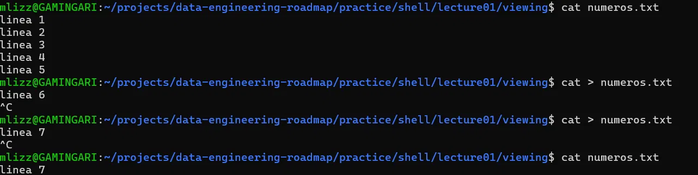
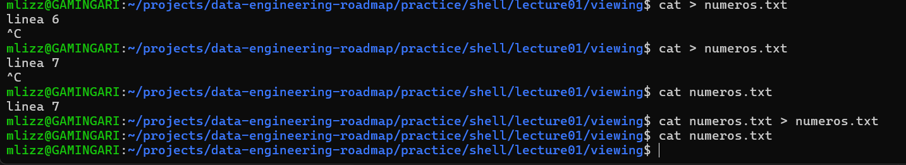

# NOTAS DE CLASE

# Fecha de creación : 01/07/2026
# RECURSOS QUE SE REVISARON PARA LA NOTAS
# VIDEO Lecture 1: Course Overview + The Shell
# OBTENCÓN DEL RECURSO: https://missing.csail.mit.edu/2026/course-shell/

# Verificación de entorno
# ¿Qué es el SHELL?
La shell es un programa que interpreta comandos escritos en texto.
ejemplo:

```bash
mlizz@GAMINGARI:~$ echo "hola mundo"
```
## Anatomia de un comando
```bash
 mlizz@GAMINGARI:~$ comando [opciones] [argumentos]
```
# Apuntes de clases
\ -> "no trates al siguiente caracter como una word boundary
ejemplo:
```bash
 mlizz@GAMINGARI:~$ echo 'jon\'s world'
```
# Comandos vistos
man comando -> brinda un manual de como usar los programas y lo que hacen, ademas de que elementos se pueden dar

comando --help -> version pequeña del man

which comando -> regresa la dirección donde el programa que se ejecuta al correr el comando esta ubicado

ejemplo: 
```bash
 mlizz@GAMINGARI:~$ which -a sh 
```
da todas las dirrecciones que encuentre de un programa llamado sh

ls -> devuelve una lista con el contenido del directorio actual

cat -> imprime el contenido del documento brindado

cd -> cambia directorios

cd/ -> root

cd~ -> ir a home

cd . -> quiere decir "en la ubicacion actual" 


cd .. -> ir al directorio padre de la carpeta actual

# las lecturas de path son de derecha a izquierda
```bash
 mlizz@GAMINGARI:~$ cd ../carpeta
```
"sube al directorio padre y luego entra a carpeta"

# Caso de uso
Si estamos en la carpeta 8057 y queremos ir a la 6858
```bash
 mlizz@GAMINGARI:~$ cd ../6858
```

# Tipo de rutas
# Rutas relativas / Relative paths
Cualquier path que no inicia con "/" despues del cd
ejemplo:
```bash
 mlizz@GAMINGARI:~$ cd /bin
```
"ir a la carpeta bin que esta en root"

# Rutas absolutas 
Cualquier path que inicia con "/" despues del cd, osea en root
```bash
 mlizz@GAMINGARI:~$ cd bin
```
"en el actual directorio ir a bin"

# Variables
$PATH -> lista de carpetas donde la shell busca programas o comandos

# Teclas auxiliares
tab -> autocompleta escritos
ctrl + c -> cancelar o interrumpir programa en ejecuccion
$ -> le dice a comandos no imprimas lo que sigue de "$" literalmente, dame el valor guardado en esa variable

# Comandos usados:

```bash
echo $SHELL
pwd
whoami
uname -a
```
# APUNTES DE PRACTICAS 1 A 8
# Exercise 1: Navegación
pwd muestra la carpeta actual.
cd carpeta entra a una carpeta.
cd .. sube a la carpeta padre.
cd ../.. sube dos niveles.
mkdir -p crea carpetas anidadas.

---------------------------------
        DUDAS SUCEDIDAS
---------------------------------
-En que orden se lee 
```bash
mlizz@GAMINGARI:~/projects/data-engineering-roadmap/practice/shell/lecture01/navigation/level1$ cd ../..
```
🫐 Cómo se lee esa ruta? de izquierda a derecha?

🍓.. → sube un nivel (de level1 a navigation)
🍓/ → separador (no hace nada por sí solo, solo conecta partes)
🍓.. → sube otro nivel (de navigation a shell)

🍓No es "ejecuta cd .., y luego por separado interpreta /..". Es una 🍓sola operación: cd recibe la ruta completa ../.. y la resuelve de un 🍓solo golpe, subiendo tantos niveles como puntos-dobles haya, en orden.

-----------------------------------------------------------------------
# Exercise 2: creacion de archivos y crear texto
echo imprime texto.
> crea o reemplaza contenido en un archivo.
>> agrega contenido al final.
cat muestra el contenido de un archivo.

# Exercise 3: ver primeras y ultimas lineas
cat muestra todo el archivo.
head -n 2 muestra las primeras 2 líneas.
tail -n 2 muestra las últimas 2 líneas.
tail -n 3 muestra las últimas 3 líneas.

tail -f deja el archivo abierto, si alguien añade lineas se veran en tiempo real.


# Exercise 4: buscar texto con `grep`
---------------------------------
        DUDAS SUCEDIDAS
---------------------------------
------------------------------------🫐-----------------------------
No entiendo el cat>numeros.txt se supone que el > es para decir, lo que te de la derecha guardalo en el recurso izquierdo pero cat es un comando para ver lo que hay dentro de un archivo entonces porque si despues de cat>numeros.txt pongo "linea 7" el archivo se queda con ese valor pero cat es para ver dentro del archivo porque regresa nada si numeros si tenia informacion
--------------------------------------------------------------------



🍓Cuando escribes cat numeros.txt, le estás dando un archivo como argumento — ahí sí "lee el archivo y te lo muestra". Pero cuando escribes cat > numeros.txt, no le diste ningún archivo de entrada — solo le diste una redirección de salida (>). Entonces cat no tiene de dónde leer más que del teclado, y se queda esperando que tú teclees.

🍓Lo que realmente pasó en la terminal
```bash
cat > numeros.txt
```

🍓Apenas ejecutas esto, > ya vació el archivo (lo trunca a 0 bytes), incluso antes de que escribas nada.

🍓cat se queda ahí, en modo "escuchando teclado", esperando que tú le des líneas.

🍓Escribiste linea 6 y le diste Enter.

🍓Presionaste Ctrl + C → esto cancela abruptamente el proceso, sin darle oportunidad de guardar bien lo que escribiste.

🍓El resultado: el archivo quedó vacío o con contenido incompleto (por eso "linea 6" no sobrevivió).

🍓Repetiste con linea 7, y esta vez sí quedó guardado — pero fue casi por timing/buffering, no porque Ctrl+C sea la forma correcta de terminar.

--------------------------------🍓-------------------------------------
Ctrl + C = "mata el proceso ya, sin preguntar" (interrupción brusca).
Ctrl + D = "fin de entrada" (EOF) — le dice a cat de forma limpia "ya no hay más texto, cierra y guarda todo bien".
-----------------------------------------------------------------------

------------------------------------🫐-----------------------------
y me imagino que aqui el porque queda vacio es por el ">" verdad? o porque no queda linea 7?
--------------------------------------------------------------------



🍓Sí, exactamente. El problema es el >.

🍓Por qué se vacía
🍓La shell no ejecuta esto en el orden que uno se imagina ("primero lee, luego escribe"). En realidad pasa así:

🍓Antes de ejecutar cat siquiera, la shell procesa la redirección >.
🍓> abre numeros.txt en modo escritura, lo cual trunca el archivo a 0 bytes inmediatamente — como abrir un cofre y tirar todo lo que tenía adentro, antes de meter algo nuevo.
🍓Ahora sí se ejecuta cat numeros.txt — pero el archivo ya está vacío, porque el paso 2 ya lo vació.
🍓cat lee... nada, porque no queda nada que leer.
🍓Ese "nada" es lo que se guarda (encima de lo que ya se había borrado).

------------------------------------🫐-----------------------------
pero entonces por lo que veo el heredoc lo unico que hace es decir que escribira un bloque completo de texto que acabara despues de poner "EOF", las "<<" no dicen o indican donde se guardara el texto no? cómo sabe cat que lo tiene que esperar? porque cat esta esperando algo para darselo a tareas.txt
--------------------------------------------------------------------

🍓No están relacionados entre sí directamente — cada uno resuelve una pregunta distinta:

🍓<< responde: ¿de dónde lee cat?
🍓> responde: ¿a dónde escribe cat?

-------------------------------------🍓---------------------------------
El orden real de armado (antes de que cat corra)
Esto es lo que responde la pregunta de fondo:

La shell lee toda la línea de comando primero, antes de ejecutar nada.
Ve > → prepara que la salida de cat vaya a tareas.txt.
Ve << EOF → recolecta todas las líneas siguientes hasta la palabra EOF, y las guarda temporalmente como si fueran "el contenido del teclado".
Ahora sí ejecuta cat, ya con todo armado:

su entrada (stdin) apunta a ese bloque de texto
su salida (stdout) apunta a tareas.txt


cat simplemente hace lo que siempre hace: lee de stdin, y lo repite en stdout. No sabe ni le importa que stdin sea un heredoc y stdout sea un archivo — solo copia de un lado a otro.
--------------------------------------------------------------------

# Exercise 5: buscar archivos con `find`

find . busca desde la carpeta actual.
-maxdepth 1 limita la búsqueda a un nivel.
-maxdepth 2 permite bajar un nivel más.
-name "*.md" busca archivos que terminan en .md.
-type f limita resultados a archivos.
-type d limita resultados a carpetas.

------------------------------------------------------------------------

# Exercise 6: columnas con `awk`
🫐 Cómo sabe awk donde acaba un campo y empieza a contar otro?

🍓awk trabaja usualmente con espacios en blanco para saber distinguir campos
abc
Entonces awk la ve así:
$1 = a
$2 = b
$3 = c
$0 = a b c

🍓pero si usamos -f 
🍓ejem: awk -F, '{print $2}' data

🍓Eso significa:
“Usa la coma , como separador de campos.”
-----------------------------------------------------------------------------

🫐 y que pasa si nuestro archivo no tiene comas como
a b c
d e f
g h i ?

--------------------------------------🍓-----------------------------------
Entonces awk mira esta línea:
a b c

y busca comas.

Pero no hay ninguna coma.

Entonces interpreta toda la línea como un solo campo:
Lo mismo con las demás líneas:
$1 = a b c
$2 = vacío
$3 = vacío

Línea 1: a b c
$1 = a b c
$2 = vacío

Línea 2: d e f
$1 = d e f
$2 = vacío

Línea 3: g h i
$1 = g h i
$2 = vacío
--------------------------------------🍓-----------------------------------

awk procesa texto línea por línea.
$1 representa el primer campo.
$2 representa el segundo campo.
$3 representa el tercer campo.
Sin -F, awk separa por espacios.
Con -F,, awk separa por comas.

-----------------------------------------------------------------------------
# Exercise 7: script basico
