# Shell Practice - Lecture 1

## Objetivo

Practicar los comandos básicos de shell vistos en la Lecture 1 de Missing Semester.

## Ejercicios

- Navegación con `pwd`, `cd`, `..`, `~`
- Creación de carpetas con `mkdir`
- Creación de archivos con `touch` y `echo`
- Redirección con `>` y `>>`
- Lectura de archivos con `cat`, `head`, `tail`
- Búsqueda de contenido con `grep`
- Búsqueda de archivos con `find`
- Procesamiento de columnas con `awk`
- Script básico con shebang

## Comandos principales

```bash
pwd
ls
cd
mkdir
touch
echo
cat
head
tail
grep
find
awk
chmod
```

---

# 1. Ejercicio 1: navegación

Desde:

```bash
 cd ~/projects/data-engineering-roadmap/practice/shell/lecture01
```
mkdir -p navigation/level1/level2
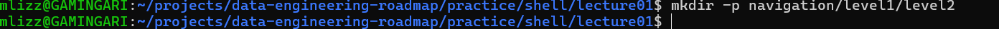

-------------------------------------------------------------------

cd navigation
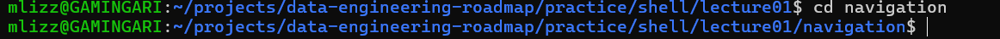

-------------------------------------------------------------------

pwd
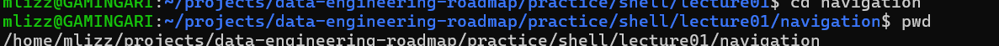

--------------------------------------------------------------------

cd carpeta
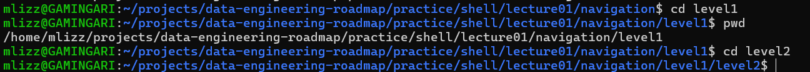

---------------------------------------------------------------------

cd ..
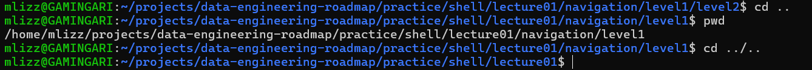

---------------------------------------------------------------------

# 2. Ejercicio 2: crear archivos y escribir texto
1.-crear carpeta files
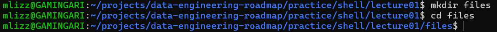

2.-Añadir texto "Primera linea"
3.-Sin reemplazar el primer texto añadimos el texto "Segunda linea"
4.-texto "Tercer linea" y visualizar
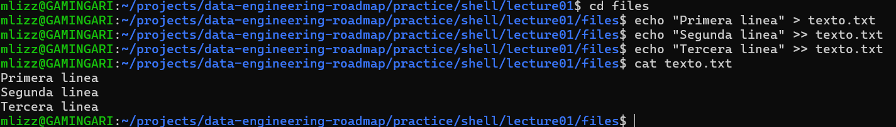

-----------------------------------------------------------------------
# Exercise 3: ver primeras y ultimas lineas
1.- configuraciones iniciales
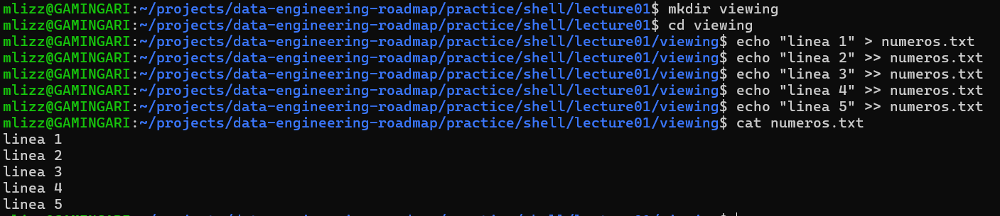

2.- pruebas head y tail
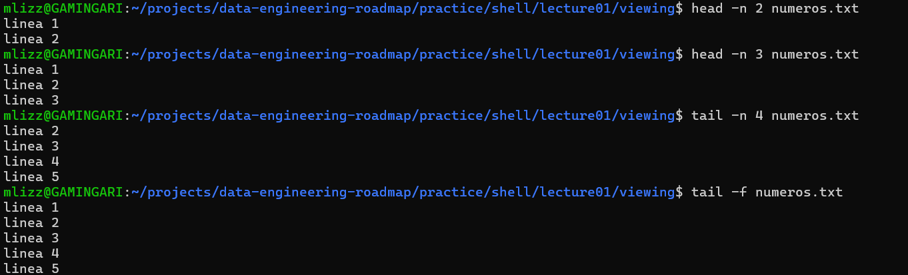

-----------------------------------------------------------------------
# Exercise 4: buscar texto con 'grep'
1.- preparar documento
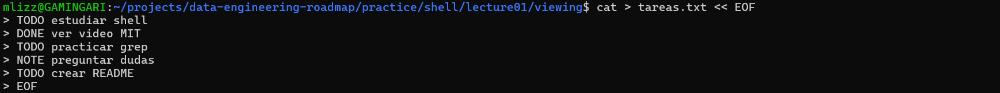

2.-pruebas con grep
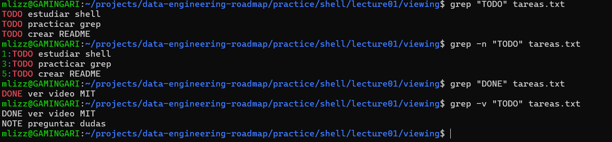

----------------------------------------------------------------------
# Exercise 5: buscar archivos con `find`
1.- terminacion .png
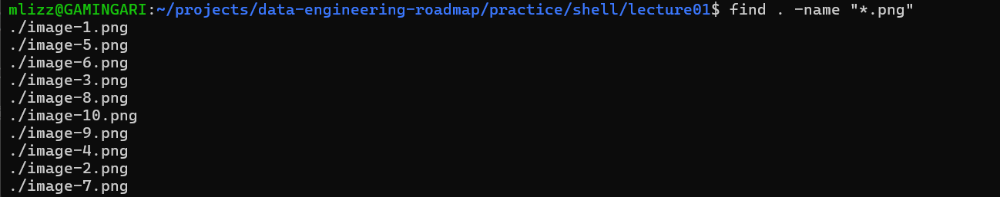

2.-profundidad
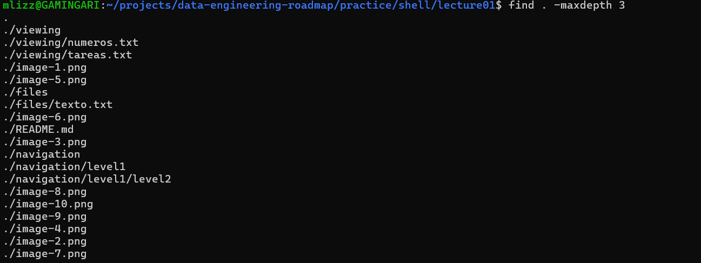

---------------------------------------------------------------------
# Exercise 6: columnas con `awk`
1.- se genera archivo de prueba
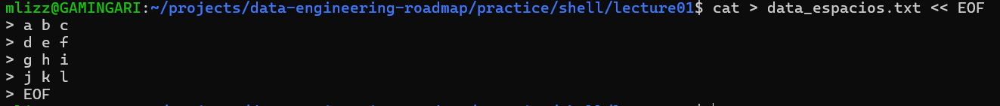

2.- pruebas
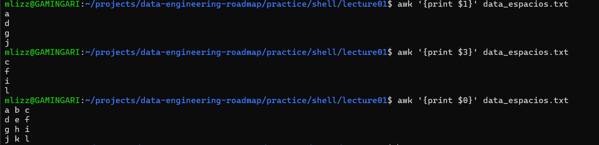

---------------------------------------------------------------------
# Exercise 7: script basico
1.- creacion de archivo
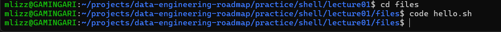

2.- contenido del script
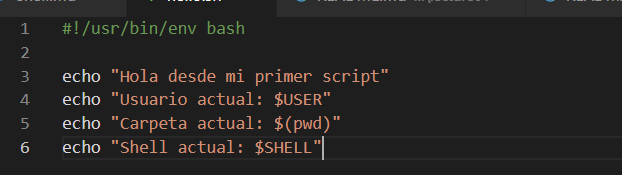

3.- otorgando permisos
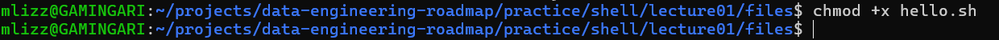

4.- ejecuccion
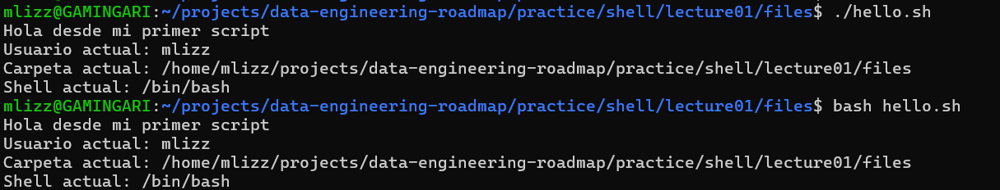
-------------------------------------------------------------------------